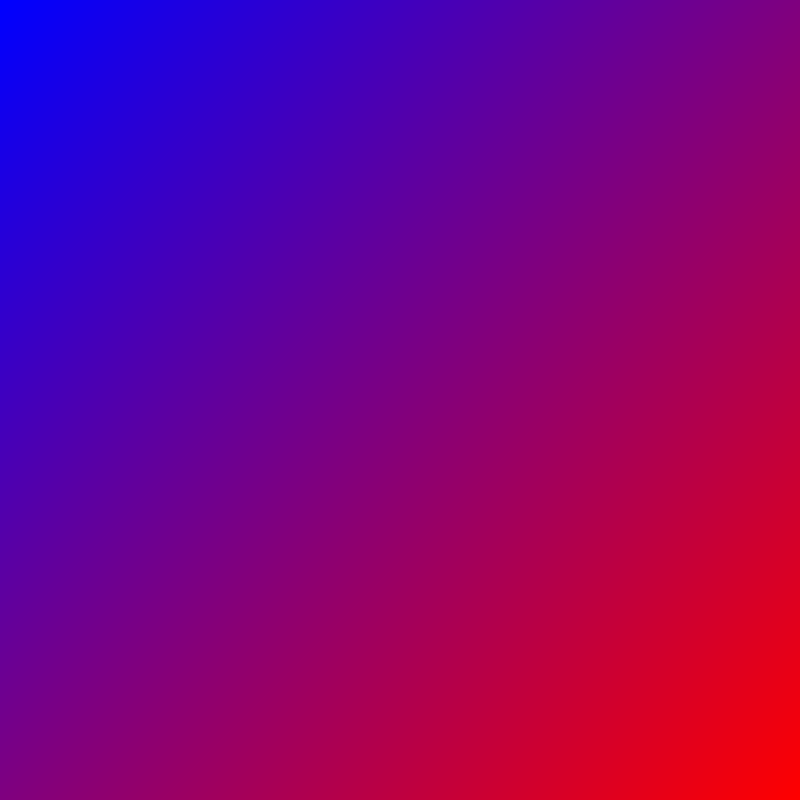
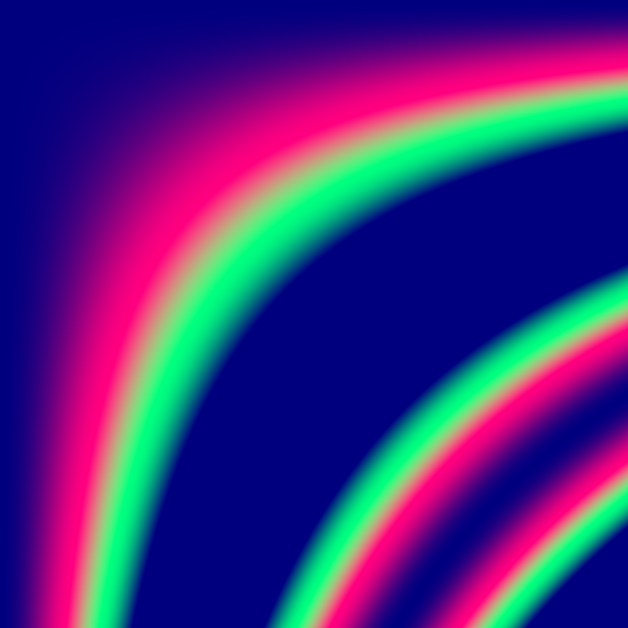
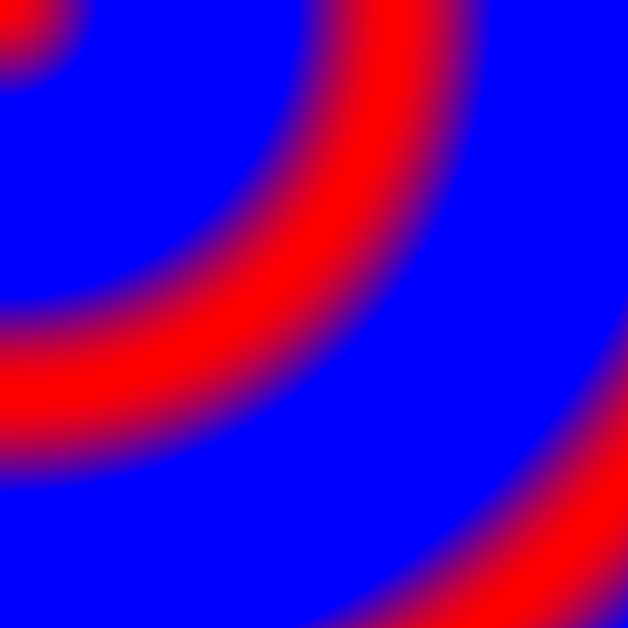

# Gradient Image Generator

This repository contains a Python script to generate gradient images using various mathematical equations and color maps. The generated images demonstrate different gradient patterns and coloring techniques.

## Examples

Below are some examples of the generated gradient images:

### Linear Gradient




### Sinusoidal Gradient


### Cosine Gradient




### Radial Sinusoidal Gradient


### Radial Cosine Gradient




## Installation

To run the script, you need to have the following libraries installed:

- `numpy`
- `Pillow`

You can install these dependencies using pip:

```bash
pip install numpy pillow
```

## Usage

The script `generate_gradients.py` generates gradient images based on predefined equations and color maps. To create and save the images, run the script:

```bash
python generate_gradients.py
```

## Script Details

The script defines several mathematical equations to create different gradient patterns and uses various color maps to colorize the gradients.

### Mathematical Equations

- **Linear Gradient**: `(lambda x, y: (x + y) / 2)`
- **Sinusoidal Gradient**: `(lambda x, y: np.sin(10 * (x**2 + y**2)))`
- **Cosine Gradient**: `(lambda x, y: np.cos(10 * (x * y)))`
- **Radial Sinusoidal Gradient**: `(lambda x, y: np.sin(10 * np.sqrt(x**2 + y**2)))`
- **Radial Cosine Gradient**: `(lambda x, y: np.cos(10 * np.sqrt(x**2 + y**2)))`

### Color Maps

- **Blue to Red**: `lambda v: (v, 0, 1 - v)`
- **Custom Gradient**: `lambda v: (v**2, v, 1 - v)`
- **Sinusoidal Gradient**: `lambda v: (np.sin(v * np.pi), np.cos(v * np.pi), 0.5)`

### Examples in Autostereogram

Autostereogram is designed to create a three-dimensional (3D) effect from a two-dimensional (2D) image. These images often appear as random dot patterns or repetitive designs and reveal a hidden 3D scene when viewed with the correct eye focus technique.

To see the hidden image, follow these steps:

1. **Relax Your Eyes**: Hold the image close to your face and let your eyes relax, as if you are looking through the image.
2. **Slowly Move the Image Away**: Gradually move the image away from your face while maintaining the relaxed focus. The hidden 3D image should start to appear.
3. **Adjust Focus**: You might need to slightly adjust your eye focus or the distance of the image to bring the hidden scene into clear view.

It can take a bit of practice, but once you get the hang of it, the hidden image should pop out.


